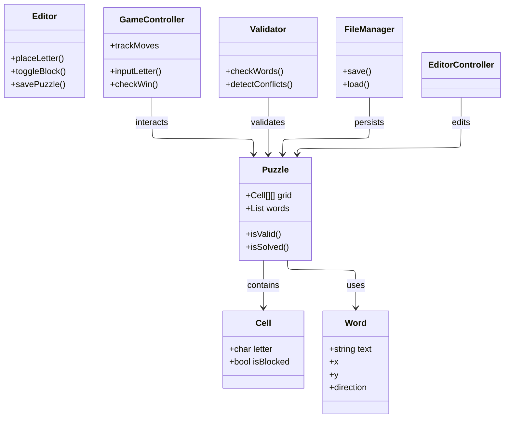
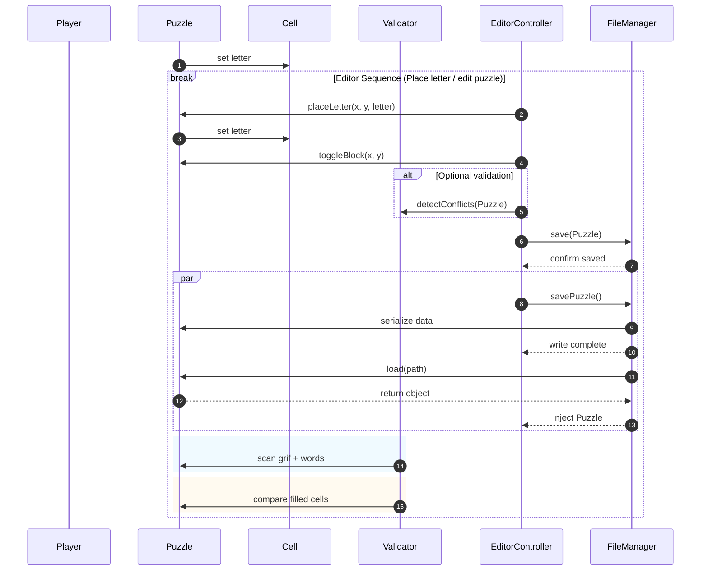

# Word-Forge

```mermaid
%%{init: {"layout": "elk"}}%%
classDiagram
class Puzzle {
  +Cell[][] grid
  +List<Word> words
  +isValid()
  +isSolved()
}

class Cell {
  +char letter
  +bool isBlocked
}

class Word {
  +string text
  +x
  +y
  +direction
}

class Editor {
  +placeLetter()
  +toggleBlock()
  +savePuzzle()
}

class GameController {
  +inputLetter()
  +trackMoves
  +checkWin()
}

class Validator {
  +checkWords()
  +detectConflicts()
}

class FileManager {
  +save()
  +load()
}

Puzzle --> Cell : contains
Puzzle --> Word : uses
EditorController --> Puzzle : edits
GameController --> Puzzle : interacts
Validator --> Puzzle : validates
FileManager --> Puzzle : persists
```

```mermaid
sequenceDiagram
    %% Gameplay Sequence (Player inputs a letter)
    participant Player
    participant Puzzle
    participant Cell
    participant Validator
    participant EditorController
    participant FileManager
    autonumber

    Puzzle->>Cell: set letter

    %% ------------------------------------------------------
    break Editor Sequence (Place letter / edit puzzle)
    participant EditorController
    participant FileManager

    EditorController->>Puzzle: placeLetter(x, y, letter)
    Puzzle->>Cell: set letter
    EditorController->>Puzzle: toggleBlock(x, y)
    alt Optional validation
        EditorController->>Validator: detectConflicts(Puzzle)
    end
    EditorController->>FileManager: save(Puzzle)
    FileManager-->>EditorController: confirm saved

    %% ------------------------------------------------------
    par
        EditorController->>FileManager: savePuzzle()
        FileManager->>Puzzle: serialize data
        FileManager-->>EditorController: write complete

        FileManager->>Puzzle: load(path)
        Puzzle-->>FileManager: return object
        FileManager-->>EditorController: inject Puzzle
    end

    %% ------------------------------------------------------
    rect rgb(240,250,255)
    Validator->>Puzzle: scan grif + words
    end

    %% ------------------------------------------------------
    rect rgb(255,250,240)
    Validator->>Puzzle: compare filled cells
    end
    end
```
